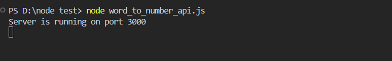
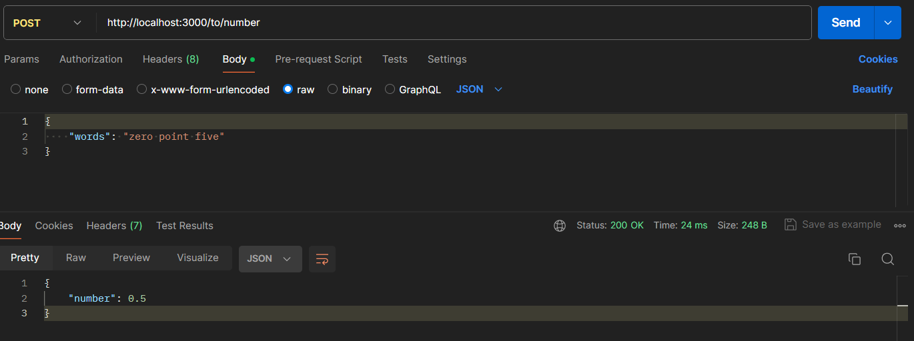
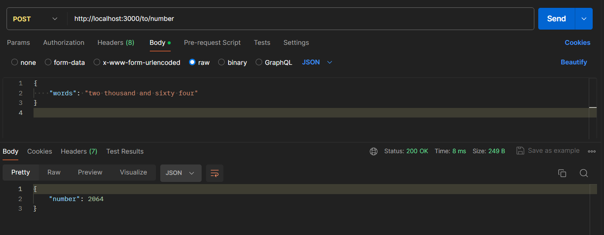
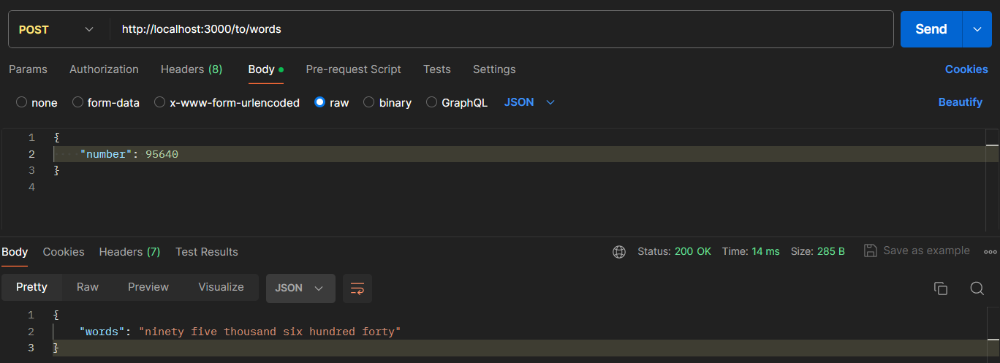
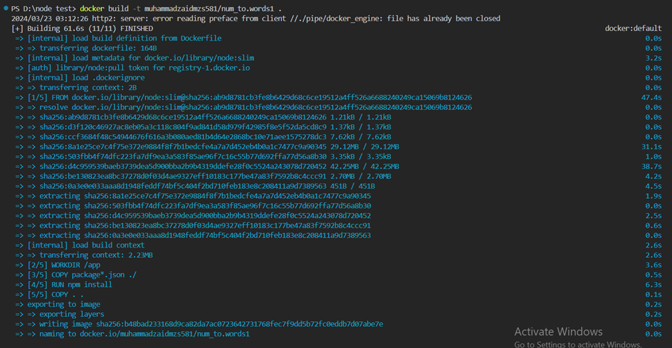
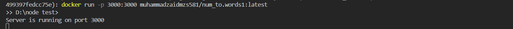
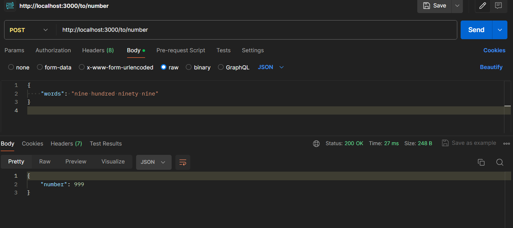
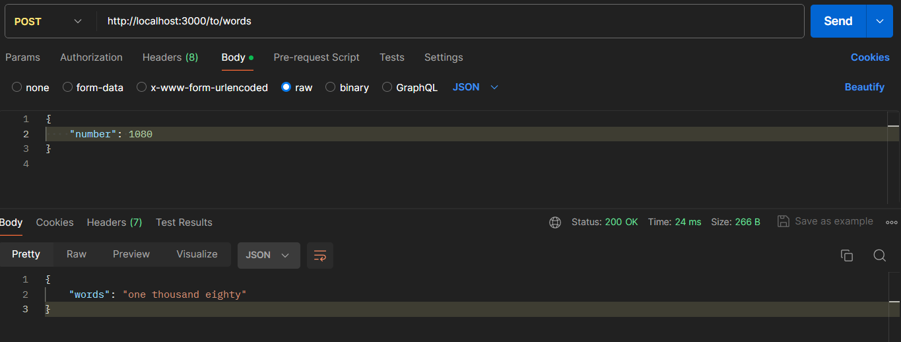
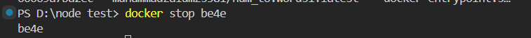

# Number-to-Words API

This project provides an API to convert numbers to words and vice versa. It supports numbers up to 9,999,999.99 and handles common English phrases for both input and output.

## UNIT TEST WITHOUT THE DOCKER BY SIMPLY RUNNING THE API

### Step 1: Running the project using the simple node command


### Step 2: Testing the API using Postman
Testing the API endpoints for converting words to numbers and numbers to words.

#### Word to Number
- **URL:** http://localhost:3000/to/number
- **Body:**
  ```json
  {
    "words": "zero point five"
  }



- **URL:** http://localhost:3000/to/number
- **Body:**
  ```json
  {
    "words": "two thousand and sixty four"
  }



#### Number to Word

- **URL:**  http://localhost:3000/to/words
- **Body:**
  ```json
  {
   "number": 95640
  }




## UNIT TEST WITH THE DOCKER BY SIMPLY RUNNING THE API

### Step 1:build a Docker Image




### Step 2: Running the Docker Image



###  Verify Using the Docker Desktop


#### Word to Number
- **URL:** http://localhost:3000/to/number
- **Body:**
  ```json
  {
    "words": "nine hundred ninety nine"
  }


#### Number to Word

- **URL:**  http://localhost:3000/to/words
- **Body:**
  ```json
  {
   "number": 1080
  }



### Step 2: Stopping the Docker Image
